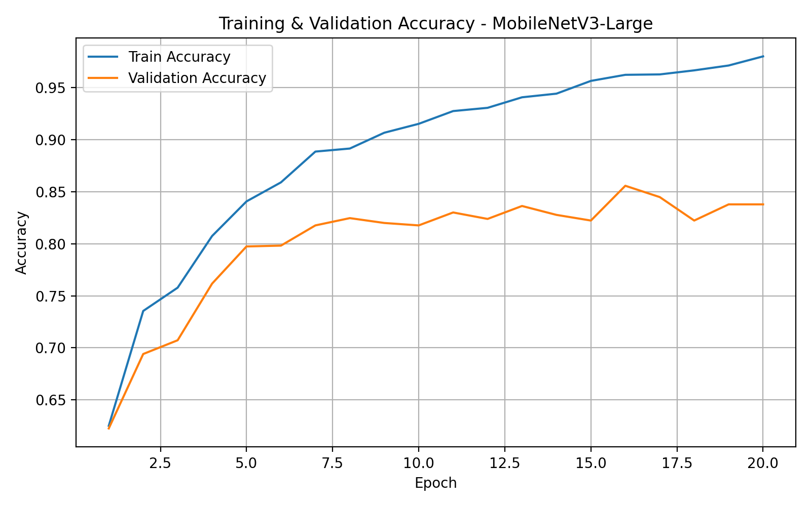
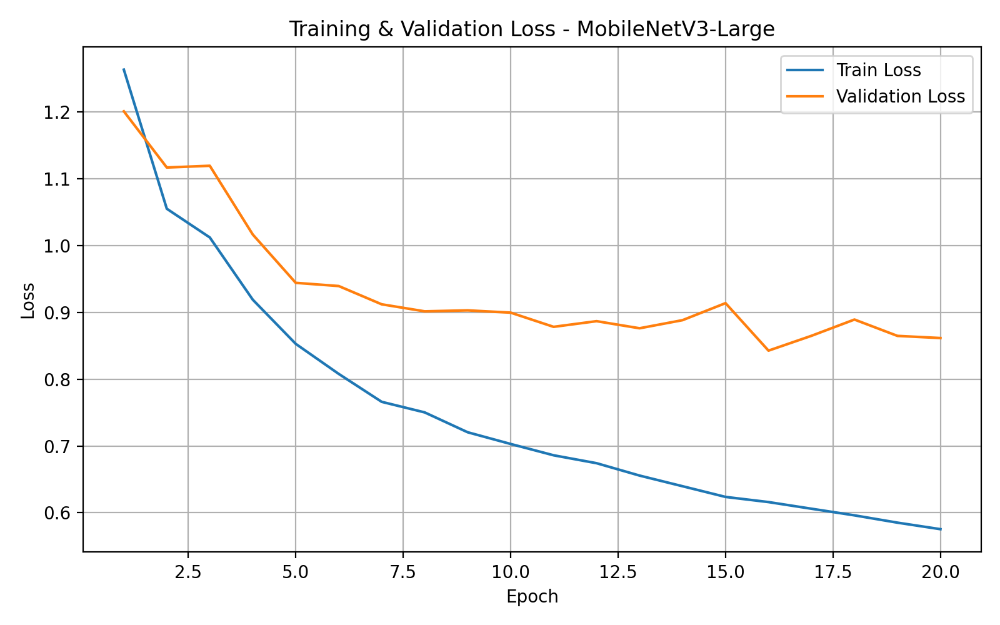
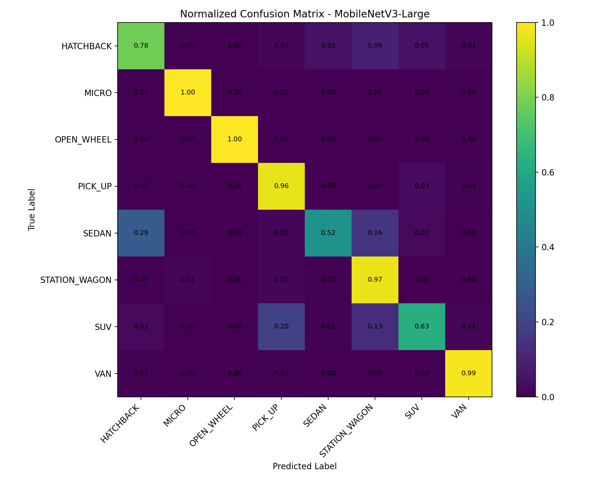

# 🚗 Car Body Type Classification Project


This project is a deep learning based **car body type classification system** developed for the **Yazılım Laboratuvarı-II Project III** assignment.

The goal is to classify car images into **8 different vehicle body types** using a custom dataset, transfer learning, model evaluation metrics, visualization outputs, and a web-based prediction interface.

---

## 🚀 Quick Start

Clone the project:

```bash
git clone https://github.com/Bou-eng/car_body_classifier.git
cd car_body_classifier
```

Create and activate a virtual environment:

```bash
python3 -m venv .venv
source .venv/bin/activate
```

Install dependencies:

```bash
pip install --upgrade pip
pip install -r requirements.txt
```

Run a single image prediction:

```bash
python src/predict.py "data/processed/val/SEDAN/example.jpg"
```

Run folder prediction and generate `preds.txt`:

```bash
python src/predict_folder.py demo_test_images --output-txt outputs/preds.txt
```

Run the Streamlit web interface:

```bash
streamlit run app/app.py
```

---

## 📌 Project Overview

This project solves a multi-class image classification problem for car body types.

The model predicts one of the following 8 classes:

| Class Number | Class Name |
|---:|---|
| 1 | SUV |
| 2 | VAN |
| 3 | STATION_WAGON |
| 4 | MICRO |
| 5 | OPEN_WHEEL |
| 6 | SEDAN |
| 7 | HATCHBACK |
| 8 | PICK_UP |

The final system includes:

- Custom image dataset
- Train / validation split
- Preprocessing and data augmentation
- Transfer learning with CNN-based models
- Model comparison
- Evaluation with Accuracy, Precision, Recall, F1-score
- Training / validation loss graph
- Training / validation accuracy graph
- Normalized confusion matrix
- Error analysis
- Single image prediction
- Folder prediction with `preds.txt`
- Streamlit web interface

---

## 🧠 Final Model

After training and comparing multiple models, the best performing model was:

```text
MobileNetV3-Large
```

The final model is saved as:

```text
models/best_model.pth
```

This checkpoint contains:

- Model name
- Model weights
- Class names
- Class-to-index mapping
- Image size
- Best validation F1-score

---

## 📊 Final Results

### Model Comparison

| Model | Validation Accuracy | Macro F1-score | SEDAN F1-score | Model Size |
|---|---:|---:|---:|---:|
| EfficientNet-B0 v1 | 0.8012 | 0.7732 | 0.23 | 15.62 MB |
| EfficientNet-B0 v2 | 0.7981 | 0.7863 | 0.39 | 15.62 MB |
| **MobileNetV3-Large** | **0.8556** | **0.8489** | **0.65** | **16.27 MB** |

The final selected model is **MobileNetV3-Large** because it achieved the highest validation macro F1-score and performed better on difficult classes such as `SEDAN`, `HATCHBACK`, and `STATION_WAGON`.

---

## 🏆 Final MobileNetV3-Large Classification Report

```text
               precision    recall  f1-score   support

    HATCHBACK       0.71      0.78      0.74       161
        MICRO       0.99      1.00      0.99       161
   OPEN_WHEEL       1.00      1.00      1.00       161
      PICK_UP       0.79      0.96      0.87       161
        SEDAN       0.89      0.52      0.65       161
STATION_WAGON       0.72      0.97      0.83       161
          SUV       0.86      0.63      0.72       161
          VAN       0.97      0.99      0.98       161

     accuracy                           0.86      1288
    macro avg       0.87      0.86      0.85      1288
 weighted avg       0.87      0.86      0.85      1288
```

---

## 📈 Training Outputs

The final model training produced the following result files:

```text
outputs/mobilenetv3_large/
├── accuracy_curve.png
├── classification_report.txt
├── confusion_matrix_normalized.png
├── loss_curve.png
└── metrics.json
```

### Training & Validation Accuracy



### Training & Validation Loss



### Normalized Confusion Matrix



---


## 🗂 Dataset

The dataset was collected and organized manually from multiple image sources.

There are 8 balanced classes:

```text
SUV
VAN
STATION_WAGON
MICRO
OPEN_WHEEL
SEDAN
HATCHBACK
PICK_UP
```

Each class was balanced to:

```text
804 images per class
```

The dataset was split into:

| Split | Images Per Class | Total Images |
|---|---:|---:|
| Train | 643 | 5144 |
| Validation | 161 | 1288 |
| Total | 804 | 6432 |

---

## 🧹 Data Preparation

The dataset preparation process included:

- Removing corrupted images
- Removing irrelevant images
- Removing duplicate or highly similar images
- Checking incorrect labels
- Balancing all classes to the same number of images
- Splitting the dataset into train and validation folders
- Applying preprocessing and augmentation during training

---

## 🖼 Preprocessing and Augmentation

All images are converted to RGB and resized to `224x224`.

### Training Transform

Training images use augmentation to improve generalization:

```text
RandomResizedCrop
RandomHorizontalFlip
RandomRotation
ColorJitter
ToTensor
ImageNet normalization
```

### Validation Transform

Validation images use deterministic preprocessing:

```text
Resize to 224x224
ToTensor
ImageNet normalization
```

Validation data is not randomly augmented because it is used to measure real model performance.

---

## 🧪 Training Strategy

The project uses **transfer learning**.

Instead of training a CNN from scratch, pretrained ImageNet models were adapted to the 8-class car body type classification task.

The following models were trained:

| Model | Purpose |
|---|---|
| EfficientNet-B0 v1 | First baseline model |
| EfficientNet-B0 v2 | Improved version with regularization |
| MobileNetV3-Large | Final selected model |

### General Training Setup

| Parameter | Value |
|---|---|
| Image size | 224x224 |
| Batch size | 32 |
| Optimizer | AdamW |
| Loss function | CrossEntropyLoss |
| Fine-tuning | Enabled |
| Early stopping | Enabled |
| Main selection metric | Validation Macro F1-score |
| Training environment | Google Colab T4 GPU |

### MobileNetV3-Large Training Setup

| Parameter | Value |
|---|---|
| Epochs | 20 |
| Best epoch | 16 |
| Classifier learning rate | 5e-4 |
| Fine-tuning learning rate | 3e-5 |
| Weight decay | 2e-4 |
| Dropout | 0.4 |
| Label smoothing | 0.1 |
| Best validation F1-score | 0.8489 |

---

## ⚖️ Class Weights

Class weights were used to reduce confusion between visually similar classes.

```text
HATCHBACK: 1.2
MICRO: 1.0
OPEN_WHEEL: 1.0
PICK_UP: 1.0
SEDAN: 1.8
STATION_WAGON: 0.9
SUV: 1.1
VAN: 1.0
```

The main reason for this adjustment was to improve performance on difficult classes such as:

```text
SEDAN
HATCHBACK
STATION_WAGON
SUV
```

---

## 🔍 Error Analysis

After model training, error analysis was performed on the validation set.

For the final MobileNetV3-Large model:

```text
Total validation images: 1288
Correct predictions: 1102
Wrong predictions: 186
Error rate: 0.1444
```

Most common confusion pairs:

| True Class | Predicted Class | Count |
|---|---|---:|
| SEDAN | HATCHBACK | 47 |
| SUV | PICK_UP | 32 |
| SEDAN | STATION_WAGON | 25 |
| SUV | STATION_WAGON | 21 |
| HATCHBACK | STATION_WAGON | 14 |

The most difficult classes were visually similar body types:

- SEDAN vs HATCHBACK
- SEDAN vs STATION_WAGON
- SUV vs PICK_UP
- SUV vs STATION_WAGON

---

## 🔢 Class Number Mapping

The project uses a fixed class number mapping for test script compatibility.

| Number | Class |
|---:|---|
| 1 | SUV |
| 2 | VAN |
| 3 | STATION_WAGON |
| 4 | MICRO |
| 5 | OPEN_WHEEL |
| 6 | SEDAN |
| 7 | HATCHBACK |
| 8 | PICK_UP |

This mapping is used when generating `preds.txt`.

---

## 🧾 Test Script Compatibility

The prediction output file must follow this exact format:

```text
filename.jpg | Tahmin: class_number
```

Example:

```text
image_001.jpg | Tahmin: 6
image_002.jpg | Tahmin: 1
image_003.jpg | Tahmin: 8
```

The script `src/predict_folder.py` automatically generates this format.

---

## 🔮 Single Image Prediction

Run prediction on one image:

```bash
python src/predict.py "path/to/image.jpg"
```

Example output:

```text
========== TAHMİN SONUCU ==========
Görsel: path/to/image.jpg
Model: mobilenetv3_large
Tahmin edilen sınıf: SEDAN
Sınıf numarası: 6
Güven skoru: %82.45
Tahmin süresi: 0.1240 saniye

Sınıf olasılıkları:
SUV: %2.10
VAN: %0.35
STATION_WAGON: %8.94
MICRO: %0.02
OPEN_WHEEL: %0.01
SEDAN: %82.45
HATCHBACK: %5.83
PICK_UP: %0.30
```

---

## 📂 Folder Prediction

To predict all images inside a folder and generate `preds.txt`:

```bash
python src/predict_folder.py demo_test_images --output-txt outputs/preds.txt
```

This creates:

```text
outputs/preds.txt
outputs/prediction_details.csv
```

`preds.txt` is used for test script compatibility.

`prediction_details.csv` contains:

- Filename
- Predicted class
- Predicted class number
- Confidence score
- Prediction time
- Probability for each class

---

## 🌐 Web Interface

The project includes a Streamlit web interface.

Run:

```bash
streamlit run app/app.py
```

The interface supports:

- Image upload
- Image preview
- Prediction button
- Predicted class name
- Class number
- Confidence score
- Prediction time
- Probability bar chart for all classes
- Model information sidebar

---

## 🧠 Model Architecture

The final model is based on **MobileNetV3-Large**.

The classifier layer was modified for 8 output classes.

General architecture flow:

```text
Input image
↓
Resize to 224x224
↓
ImageNet normalization
↓
MobileNetV3-Large feature extractor
↓
Dropout
↓
Linear classifier
↓
Softmax probabilities
↓
Predicted class
```

---

## 📦 Requirements

Main libraries:

```text
torch
torchvision
pillow
numpy
pandas
matplotlib
scikit-learn
streamlit
tqdm
```

Install all requirements:

```bash
pip install -r requirements.txt
```

---

## 💻 Device Support

The code automatically selects the best available device:

| Device | Usage |
|---|---|
| CUDA | NVIDIA GPU training / inference |
| MPS | Apple Silicon GPU inference or small tests |
| CPU | Fallback mode |

Device selection order:

```text
CUDA → MPS → CPU
```

---

## 🧪 Re-training

To train MobileNetV3-Large again:

```bash
python src/train_mobilenetv3_large.py
```

To train EfficientNet-B0 v2:

```bash
python src/train_efficientnet_b0_v2.py
```

Training outputs are saved under:

```text
outputs/
models/
```

---

## 📊 Evaluation Metrics

The following metrics are calculated:

- Accuracy
- Precision
- Recall
- F1-score
- Macro average
- Weighted average
- Per-class metrics
- Normalized confusion matrix

The main selection metric is:

```text
Validation Macro F1-score
```

---

## 🧩 Known Limitations

The model performs very well on visually distinct classes such as:

- MICRO
- OPEN_WHEEL
- VAN

However, some classes remain challenging because of visual similarity:

- SEDAN vs HATCHBACK
- SEDAN vs STATION_WAGON
- SUV vs PICK_UP
- SUV vs STATION_WAGON

These errors are expected because some vehicle body types are visually very close, especially in side or rear angle images.

---


## 🧪 Example Demo Flow

During the demo:

1. Start the Streamlit app:

```bash
streamlit run app/app.py
```

2. Upload a car image.

3. Click **Tahmin Yap**.

4. Show:

```text
Predicted class
Class number
Confidence score
Prediction time
Probability distribution
```

5. If a test folder is provided, generate `preds.txt`:

```bash
python src/predict_folder.py path/to/test_images --output-txt outputs/preds.txt
```

---

## 🛠 Troubleshooting

### Model file not found

Make sure this file exists:

```text
models/best_model.pth
```

### Wrong class number in preds.txt

Check the mapping in `src/predict.py`:

```text
SUV → 1
VAN → 2
STATION_WAGON → 3
MICRO → 4
OPEN_WHEEL → 5
SEDAN → 6
HATCHBACK → 7
PICK_UP → 8
```

### Streamlit does not start

Install Streamlit:

```bash
pip install streamlit
```

Then run:

```bash
streamlit run app/app.py
```

### Prediction is slow

Use a GPU if available. The model is lightweight, but CPU inference can still be slower depending on hardware.

### CUDA is not available

Check your PyTorch installation and GPU runtime. On Google Colab, select:

```text
Runtime → Change runtime type → T4 GPU
```

---

## 📌 Final Decision

The final model is:

```text
MobileNetV3-Large
```

Reason:

- Highest validation macro F1-score
- Highest validation accuracy
- Better performance on difficult classes
- Small model size
- Fast enough for web interface inference
- Suitable for the 95 MB model size limit

---

## 👤 Author

**Bou-eng**

GitHub: [Bou-eng](https://github.com/Bou-eng)

---

## 📄 License

This project was developed for an academic course project.

```text
Kocaeli University
Computer Engineering Department
```
